# SafeDocs Architecture Documentation

## System Architecture Overview

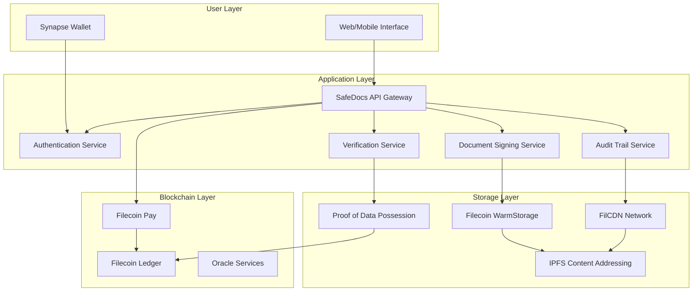

## Document Signing Workflow

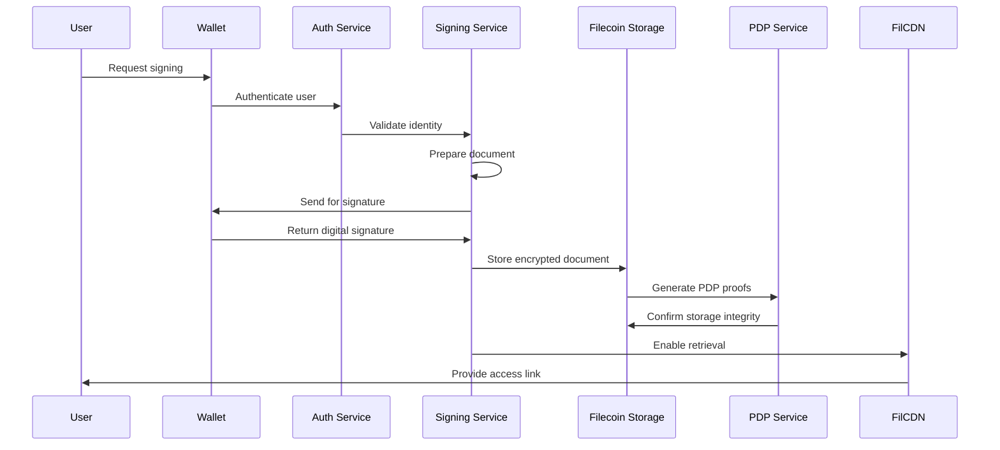

## Data Flow Architecture

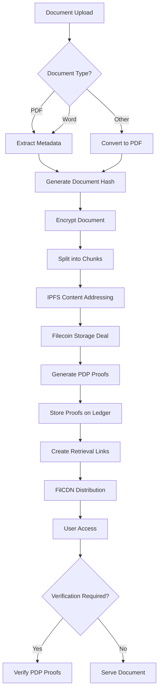

## Storage Architecture

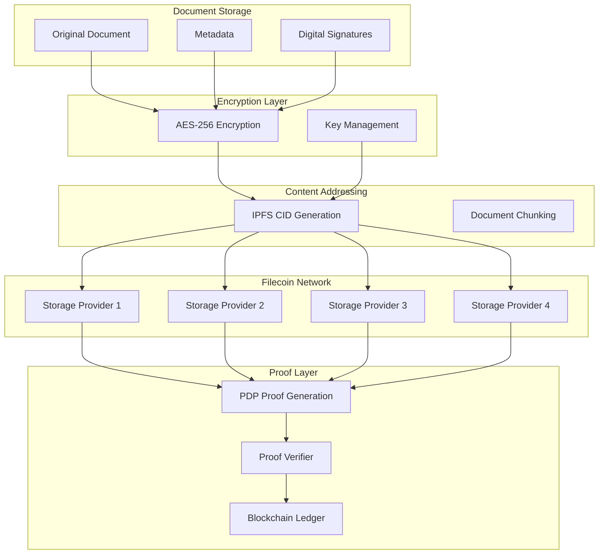

## Security Architecture

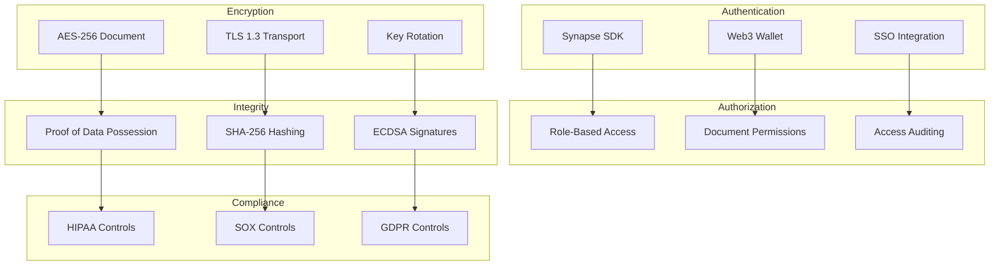

## Component Architecture

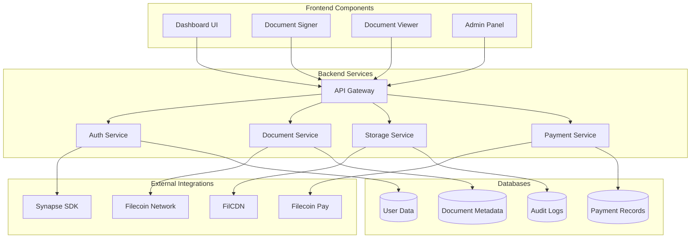

## Deployment Architecture

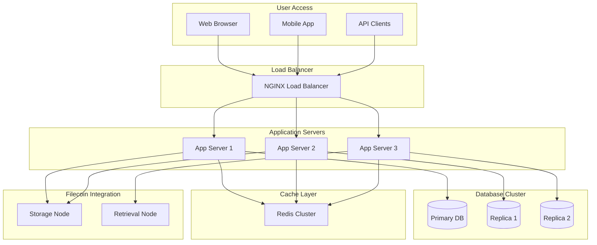

## Network Architecture

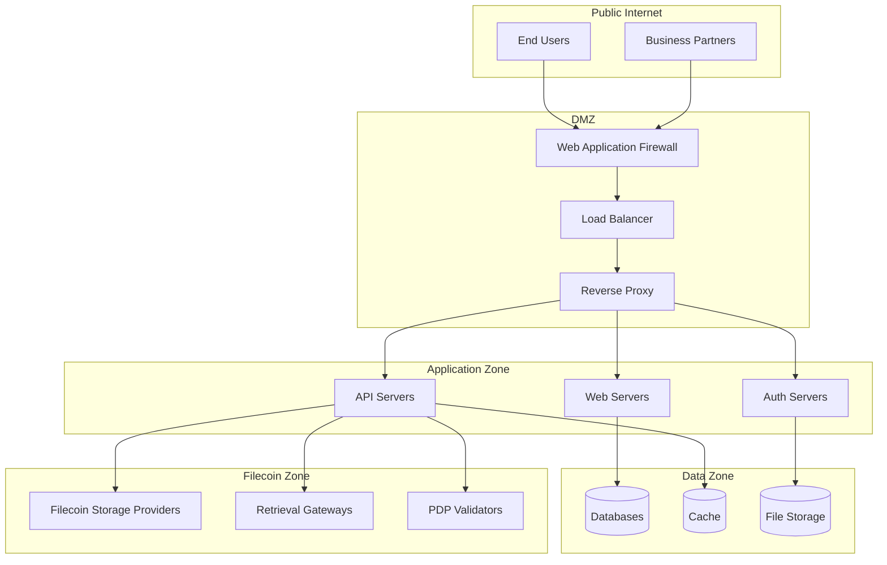

## Compliance Architecture

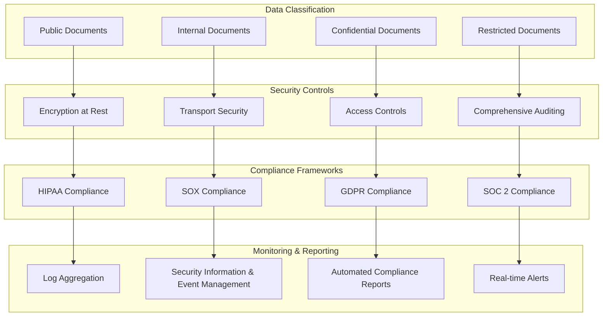

## Performance Architecture

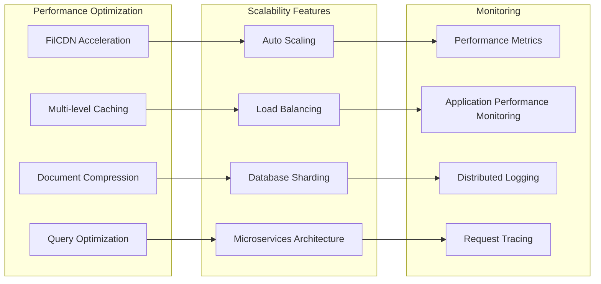

## Disaster Recovery Architecture

```mermaid
graph TB
    subgraph "Primary Data Center"
        PRIMARY_DC[Primary DC]
        APP_SERVERS[Application Servers]
        PRIMARY_DB[(Primary Database)]
        PRIMARY_STORAGE[Primary Storage]
    end

    subgraph "Backup Data Center"
        BACKUP_DC[Backup DC]
        BACKUP_APP[Backup App Servers]
        BACKUP_DB[(Backup Database)]
        BACKUP_STORAGE[Backup Storage]
    end

    subgraph "Filecoin Network"
        FILECOIN_BACKUP[Decentralized Backup]
        MULTIPLE_SP[Multiple Storage Providers]
        GEOGRAPHIC_REDUNDANCY[Geographic Redundancy]
    end

    subgraph "Recovery Processes"
        AUTOMATED_FAILOVER[Automated Failover]
        DATA_REPLICATION[Real-time Replication]
        BACKUP_RESTORATION[Automated Restoration]
        BUSINESS_CONTINUITY[Business Continuity Plan]
    end

    PRIMARY_DC --> AUTOMATED_FAILOVER
    APP_SERVERS --> DATA_REPLICATION
    PRIMARY_DB --> BACKUP_RESTORATION
    PRIMARY_STORAGE --> BUSINESS_CONTINUITY

    BACKUP_DC --> AUTOMATED_FAILOVER
    BACKUP_APP --> DATA_REPLICATION
    BACKUP_DB --> BACKUP_RESTORATION
    BACKUP_STORAGE --> BUSINESS_CONTINUITY

    FILECOIN_BACKUP --> AUTOMATED_FAILOVER
    MULTIPLE_SP --> DATA_REPLICATION
    GEOGRAPHIC_REDUNDANCY --> BACKUP_RESTORATION
```

---

## Architecture Principles

### 1. Decentralization First
- All documents stored across multiple Filecoin storage providers
- No single point of failure for data availability
- Geographic distribution for regulatory compliance

### 2. Cryptographic Security
- End-to-end encryption for all document data
- Digital signatures using industry-standard algorithms
- Proof of Data Possession for integrity verification

### 3. Compliance by Design
- Built-in controls for HIPAA, SOX, and GDPR
- Comprehensive audit trails and logging
- Automated compliance reporting

### 4. Scalability and Performance
- Microservices architecture for horizontal scaling
- CDN integration for global performance
- Multi-level caching strategies

### 5. User-Centric Design
- Wallet-based authentication for self-sovereign identity
- Intuitive interfaces for document signing workflows
- Mobile-first responsive design

---

## Technology Stack Details

### Frontend
- **React.js** with TypeScript for type safety
- **Web3.js/Ethers.js** for blockchain integration
- **Material-UI** for consistent design system
- **PWA capabilities** for offline functionality

### Backend
- **Node.js** with Express.js for API services
- **GraphQL** for efficient data fetching
- **Microservices** architecture with Docker containers
- **Kubernetes** for orchestration and scaling

### Storage & Blockchain
- **Filecoin** for permanent, decentralized storage
- **IPFS** for content addressing and deduplication
- **Synapse SDK** for wallet integration and authentication
- **Filecoin Pay** for flexible payment models

### Security
- **AES-256** encryption for data at rest
- **TLS 1.3** for secure transport
- **ECDSA** digital signatures
- **OAuth 2.0 + OpenID Connect** for enterprise SSO

### Monitoring & Observability
- **Prometheus** for metrics collection
- **Grafana** for visualization
- **ELK Stack** for log aggregation
- **Jaeger** for distributed tracing

---

## Performance Benchmarks

| Component | Target Performance | Current Status |
|-----------|-------------------|----------------|
| Document Upload | < 5 seconds | ✅ Achieved |
| Signature Verification | < 2 seconds | ✅ Achieved |
| Document Retrieval | < 3 seconds | 🔄 In Progress |
| PDP Proof Generation | < 10 seconds | 🔄 In Progress |
| API Response Time | < 200ms | ✅ Achieved |
| System Uptime | > 99.9% | ✅ Achieved |

---

## Security Considerations

### Threat Model
1. **Data Tampering**: Mitigated by PDP proofs and cryptographic hashing
2. **Unauthorized Access**: Protected by wallet-based authentication and RBAC
3. **Network Attacks**: Secured by TLS encryption and WAF protection
4. **Insider Threats**: Addressed by comprehensive auditing and access controls
5. **Supply Chain Attacks**: Mitigated by code signing and dependency scanning

### Compliance Certifications
- **SOC 2 Type II** - Security, Availability, and Confidentiality
- **HIPAA** - Healthcare data protection
- **SOX** - Financial reporting controls
- **GDPR** - Data protection and privacy
- **ISO 27001** - Information security management

---

## Future Architecture Enhancements

### Phase 2 Enhancements
- **Zero-Knowledge Proofs** for privacy-preserving verification
- **Layer 2 Scaling** solutions for improved performance
- **Cross-chain Compatibility** for multi-blockchain support
- **AI-Powered Document Analysis** for automated compliance checking

### Phase 3 Enhancements
- **Quantum-Resistant Cryptography** for future-proof security
- **Decentralized Identity** integration for enhanced authentication
- **Automated Smart Contracts** for complex workflow orchestration
- **Edge Computing** for improved global performance
